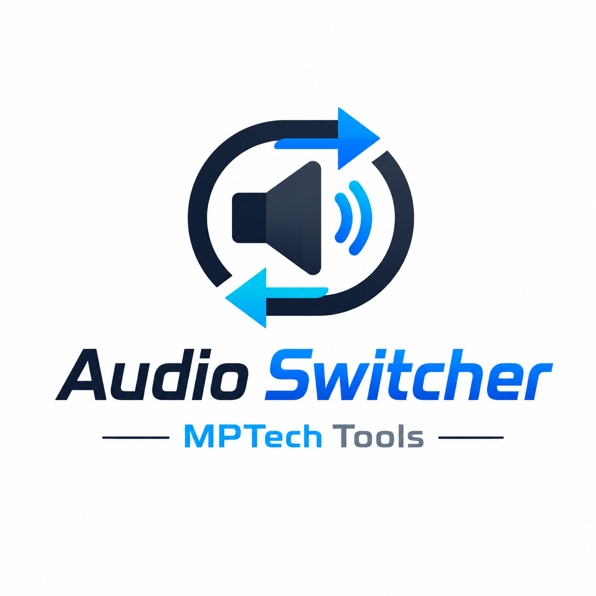

# Windows Tools

A growing collection of small, portable Windows utilities built for technicians, sysadmins, developers, IT students and advanced users.

Each tool has its own repository and release page.

## Tools

### Audio Device Switcher

  

Quickly switch between Windows audio output devices from a simple desktop utility.

- Repository: https://github.com/xml2811/Audio-Switcher
- Download: https://github.com/xml2811/Audio-Switcher/releases/latest

### Link Downloader

  

Portable Windows utility for downloading links and keeping a simple local workflow.

- Repository: https://github.com/xml2811/Link-Downloader
- Download: https://github.com/xml2811/Link-Downloader/releases/latest

### MPTech Network Tools

  

Portable Windows toolkit for network diagnostics, local network scan, ping, TCP ports, traceroute and TXT reports.

- Repository: https://github.com/xml2811/Network-Tools
- Download: https://github.com/xml2811/Network-Tools/releases/latest

## Current tools

| Tool | Status | Main use |
|---|---|---|
| Audio Device Switcher | Released | Switch audio output devices |
| Link Downloader | Released | Download links from a desktop utility |
| MPTech Network Tools | Released | Network diagnostics and local scan |

## Author

Created by Xavier Madrid Lerga.

GitHub: https://github.com/xml2811